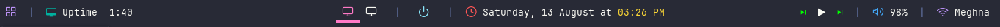
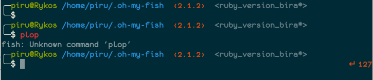

_Disclaimer_: I am in no way a ricing expert. This guide is intended for fellow beginners confused on the very basics when it comes to the customization of their linux distro.
## Introduction

Hi! If you are follower of [r/unixporn](https://www.reddit.com/r/unixporn/) you may have already came across various linux rice's and know how cool they appear.
In this blog, i will try to share my experience in ricing.
If you're not aware about the term ricing then, the phrase means **to express the practice of customizing, souping-up, or making a unix (Linux) desktop or installation more interesting**.


## Prerequisites

To rice any linux distro the foremost thing is to choose a linux distro, there are numerous distro's and it takes time to find the best which suits you.
The distro's i have came across are:-
* Ubuntu (Debian based)
* Linux Mint (Ubuntu based)
* Pop OS (Ubuntu based)
*  Manjaro (Arch based)
* Zorin OS (Ubuntu based)

From this list of distro's, i settled on pop os, because of its wonderful _tiling window manager_. Manjaro is also wonderful as its arch based ricing become much easier on it to install Window Manager. All ubuntu based Distro in this list have GNOME as Desktop Environments, but can be changed.

## What is Window manager and desktop environments
Desktop environments ships with its window manager, the speed of your distro ( ram memory and cpu usage) depends on what desktop environment you are using. Whereas window manager defines how a window wil appear its top bar, its color , its transparency and also its shape is defined by window manager. Will ricing you must focus on window manager as it define look rather than performance.
Most above listed distro comes with various flavor of DE like :
-	GNOME
-   KDE
-   Cinnamon
-   Xfce
-   MATE
-   Pantheon		

> If you have a low end pc then go with xfce, and if high end pc then  
> go with KDE.

				

## Selecting Window Manager

The most popular WMs at the moment seem to be the young [bspwm](https://github.com/baskerville/bspwm) and the widely used [i3wm](https://i3wm.org/), though people are also making some awesome [openbox](http://openbox.org/wiki/Main_Page) desktops.

> As i am using pop os, i will stick to its WM that is mutter it has
> wonderful tile management. If you have chosen other distro you can go
> with [i3wm](https://i3wm.org/).

## Gnome GTK dracula theme
If you are using gnome DE then you can use gtk theme that [gnome-store](https://www.gnome.org/) provides. This following gtk theme is my favorate.
### Gtk Theme 
- #### Install manually

Download using the [GitHub .zip download](https://github.com/dracula/gtk/archive/master.zip) option and extract the `.zip` file to the themes directory i.e. `/usr/share/themes/` or `~/.themes/` (create it if necessary).

- #### Activating theme

To activate the theme in Gnome, run the following commands in Terminal:

```
gsettings set org.gnome.desktop.interface gtk-theme "Dracula"
gsettings set org.gnome.desktop.wm.preferences theme "Dracula"

```

or Change via distribution specific tweak tool.

### Icon Theme 

- #### Install manually

Download using the [GitHub .zip download](https://github.com/dracula/gtk/files/5214870/Dracula.zip) option and extract the `.zip` file to the icons directory i.e. `/usr/share/icons/` or `~/.icons/` (create it if necessary).

- #### Activating icon theme

To activate the theme in Gnome, run the following commands in Terminal:

```
gsettings set org.gnome.desktop.interface icon-theme "Dracula"

```

or Change via distribution specific tweak tool.

## Polybar - Beautiful and customizable top bar.


Lots of redditors in [r/unixporn](https://www.reddit.com/r/unixporn/) are also using some sort panel or bar in the configuration which displays all sorts of information such as the time, volume, even the current song playing. There are various top bar but i use [polybar](https://github.com/polybar/polybar).

> Disclaimer: To use polybar you must first hide the default bar, to do
> so you can use gnome extension hide top bar or follow some other
> method based on your DE

### Install Polybar

```bash
sudo apt install polybar

```

Or

```bash
sudo apt-get install cmake cmake-data libcairo2-dev libxcb1-dev libxcb-ewmh-dev libxcb-icccm4-dev libxcb-image0-dev libxcb-randr0-dev libxcb-util0-dev libxcb-xkb-dev pkg-config python3-xcbgen xcb-proto libxcb-xrm-dev i3-wm libasound2-dev libmpdclient-dev libiw-dev libcurl4-openssl-dev libpulse-dev
sudo apt install libxcb-composite0-dev
sudo apt install libjsoncpp-dev
sudo ln -s /usr/include/jsoncpp/json/ /usr/include/json
git clone https://github.com/jaagr/polybar.git
cd polybar && ./build.sh
```
### Polybar mine config files:

- [Polybar theme](https://github.com/FreakStar03/PopOs-Rice)
### Prerequistes for mine config
- ### playerctl

```
wget http://ftp.nl.debian.org/debian/pool/main/p/playerctl/libplayerctl2_2.0.1-1_amd64.deb
wget http://ftp.nl.debian.org/debian/pool/main/p/playerctl/playerctl_2.0.1-1_amd64.deb
sudo dpkg -i libplayerctl2_2.0.1-1_amd64.deb playerctl_2.0.1-1_amd64.deb

```

- ### zscroll

```
$ git clone https://github.com/noctuid/zscroll
$ cd zscroll
$ sudo python3 setup.py install

```

- ### rofi

```
sudo apt-get install rofi

```

- ### wmctrl

```
sudo apt install wmctrl

```
### Give Execution Permission

```bash
chmod +x ~/.config/polybar/scripts/*.sh
chmod +x ~/.config/polybar/scripts/*.sh
```

### To auto start put following line in ~/.profile

```
~/.conig/launch.sh
```

### To Run

```
./.config/polybar/launch.sh
```

### To Stop

```
pkill polybar
```

## Terminal
The terminal is the most essential part of linux experience so a beautiful term is also essential. The default terminal may **gnome terminal** (Gnome) or **konsole** (kde) based on DE, but i wanted a feature reach terminal so i chosen [kitty - Kovid Goyal](https://sw.kovidgoyal.net/kitty/) which as various features like -
-   Graphics, with [images and animations](https://sw.kovidgoyal.net/kitty/graphics-protocol/)
    
-   Ligatures and emoji, with [`per glyph font substitution`](https://sw.kovidgoyal.net/kitty/conf/#opt-kitty.symbol_map)
    
-   [Hyperlinks](https://sw.kovidgoyal.net/kitty/glossary/#term-hyperlinks), with [configurable actions](https://sw.kovidgoyal.net/kitty/open_actions/)

You can follow its [documentation](https://sw.kovidgoyal.net/kitty/binary/#binary-install) for kitty installation.
Once terminal is customized lets move to shell, you can stick to bash shell and customize it with [oh-my-bash](https://github.com/ohmybash/oh-my-bash) and its theme's
Below is example of oh-my-bash power-line-theme to install it follow the [Readme](https://github.com/ohmybash/oh-my-bash).
 Similarly there are various shell's like bash... that include popular one's like 
 - [fish shell](https://fishshell.com/)
 -  z shell (used by kali linux as default )

 To install Theme's in any of above shell's you can install [Oh My Zsh](https://ohmyz.sh/) or [oh-my-fish](https://github.com/oh-my-fish/oh-my-fish) respectively.

> The reason why i choose the Fish Shell is due to the IDE like type
> suggestion that it provides by default, same live suggestion is also
> provided by zsh.
> My current fish theme: 



# Thank you

That's it, i loved to share what i know about linux ricing with you all and hope you also liked my content ... do give a try to mine other works, i  hope we will meet again it then keep learning. 


